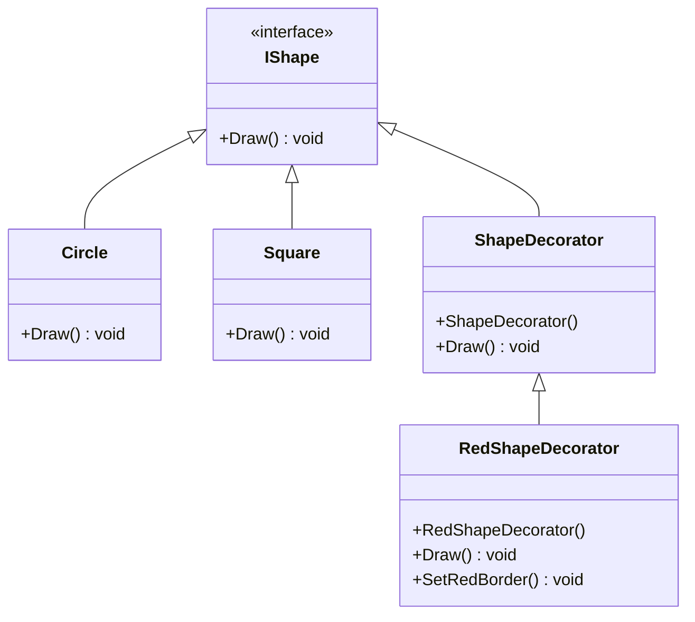

```mermaid

	classDiagram
    
	class IShape
	<<interface>> IShape
	IShape : +Draw() void
	
	IShape <|-- Circle : 
	Circle : +Draw() void
	
	IShape <|-- Square : 
	Square : +Draw() void
	
	IShape <|-- ShapeDecorator : 
	ShapeDecorator : +ShapeDecorator()
	ShapeDecorator : +Draw() void
	
	ShapeDecorator <|-- RedShapeDecorator
		RedShapeDecorator : +RedShapeDecorator()
	RedShapeDecorator : +Draw() void
	RedShapeDecorator : +SetRedBorder() void
```

> Written with [StackEdit](https://stackedit.io/).